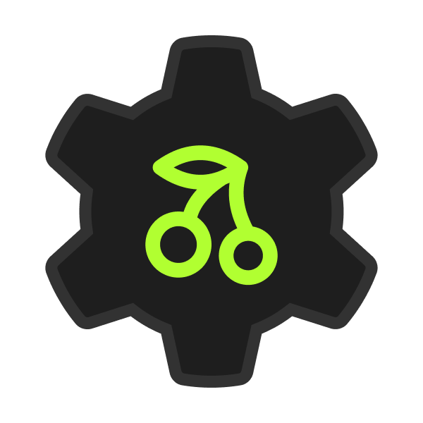
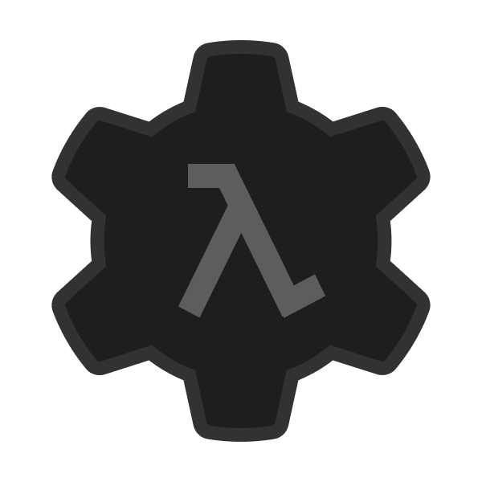
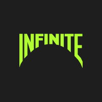

<a href="https://infinite.si">
  <h1 align="center">
    <picture>
      <source media="(prefers-color-scheme: dark)" srcset="./assets/pp1.png">
      
    </picture>
  </h1>
</a>

Hello! I'm **Diego**, a passionate advocate for useful, relevant, and healthy technology. My mission is to make tech better, healthier, more secure, and more sustainable. I'm also the founder of [**Infinite**](https://github.com/infiniteHQ).

Most of my work focuses on finding solutions to make technology healthier and more beneficial, while actively combating harmful practices and negative aspects. You can check out the [manifesto](https://manifesto.infinite.si/) I follow for more details.

# My works on [Infinite](https://github.com/infiniteHQ)

|                | **Project**                                                                                                           | **Description**                                                                                                                                              |
|-------------------------|--------------------------------------------------------------------------------------------------------------------|--------------------------------------------------------------------------------------------------------------------------------------------------------------|
|   | [**Cherry**](https://github.com/infiniteHQ/Cherry)                                                                  | Cherry is a modern, minimalist yet comprehensive UI/UX framework for low-level native applications. It provides a complete solution, including backend support, a rendering engine, and UI components. Built using technologies like ImGui, Vulkan, and SDL. |
|   | [**Shelly**]()                                                                  | Shelly is a Wayland compositor and desktop shell, oriented around a tabbed windows paradigm with a really simple UX flow. It is an alternative to the classic windowed desktop manager, and its goal is to be easier to use than other tabbed DEs.  |
|  | [**Vortex**](https://github.com/infiniteHQ/Vortex)                                                                  | Vortex is a comprehensive open creation platform offering a variety of tools for creators and developers. It enables the creation of systems, applications, services, and much more. |
|  | [**Nodals** (Vortex)](https://github.com/infiniteHQ/Vortex)                                                    | Vortex Nodals is an advanced visual programming interface designed to make coding accessible to everyone, even without prior programming knowledge. Features powerful transpilers to support coding visually and extensive support for new languages like Rust, Go, and Zig. |
|  | [**Fusion** (Vortex)](https://github.com/infiniteHQ/Vortex)                                                    | Fusion is a toolset designed to make the development of systems, embedded systems, and applications easy and intuitive. It abstracts complex concepts, allowing developers to focus on design, development, and production without worrying about underlying system complexities. |
|  | **Hypernet**                                                                                                       | Hypernet is an advanced networking technology designed around a sandbox paradigm, enabling extensive modding and customization. Originally created to push the boundaries of decentralized networking and environmental networking. |
|    | **Labs**                                                                                                           | Infinite Labs is a sharing platform for makers, aimed at simplifying the process of creating and developing projects. It offers a variety of tools and resources to help creators streamline their workflows and enhance productivity. |

### Around Infinite...

|                | **Project**                | **Description**                                                                                                                                              |
|----------------|---------------------------|--------------------------------------------------------------------------------------------------------------------------------------------------------------|
|  | **Infinite Websites**        | Design of the [main Infinite website](https://infinite.si/), the [Manifesto website](https://manifesto.infinite.si/), the [user and pro accounts website](https://accounts.infinite.si/), and the [funding platform](https://fund.infinite.si/).  |
|  | **Infinite Services**        | Implementation of a complete infrastructure to manage and automate all **Infinite services**, such as the **auth system**, **Infinite accounts**, **the blog**, **user badges**, **feedback and Vortex update services**, **funding services**, **forums**, and the **community store**. This setup enables testing and production deployment right after a commit/push, allowing error analysis through an advanced API Gateway that handles load balancing, rate limiting, service-to-service communication, secure authentication, and service redundancy, all contributing to a highly reliable and powerfull infrastructure. The architecture is organized as a microservices system grouped under this API gateway, combining the best of both microservices and centralized service models. The Infinite infrastructure also includes multiple high-level security measures at the system, execution, and service layers. Authentication relies on OAuth 2.1, two-factor authentication (2FA), and other security best practices to ensure account safety.  |
|  | **Around Vortex**                    | Design of the [Vortex website](https://vortex.infinite.si/), including feedback services and tools to manage production and updates, with stable, beta, and testing programs. Design of the [Vortex Launcher](https://github.com/infiniteHQ/VortexLauncher), allowing users to organize their Vortex environment, and creation of the [Vortex Installer](https://github.com/infiniteHQ/VortexInstaller), which makes it easy to install, update, and uninstall both Vortex and the Launcher. Design of the Vortex community store (WIP), enabling users to upload and retrieve content for creation and development purposes. Integration of a Vortex news system, which the Launcher checks to display the latest updates.|

# My side projects

| **Project**                                                                                                           | **Description**                                                                                                                                              |
|--------------------------------------------------------------------------------------------------------------------|--------------------------------------------------------------------------------------------------------------------------------------------------------------|
| **Top Down Voxel Game**                                                                 | [Quick video of the prototype](https://www.youtube.com/watch?v=yEAfgGU4cqY&list=LL&index=9) This is a little side project with Raylib written in C to learn more about 3D rendering, math, and shaders. |
| **Tank Shooter**                                                                 | High performance and low latency shooter over UDP/TCP in C++, videos comming soon ! :) |

> [!NOTE]  
> Some repositories don't have links yet, as we are still stabilizing the libraries to avoid wasting the time of users who want to try them out. However, they will be available very soon :)

# Contact

|                                                                                                           |                                                                                                                                             |
|--------------------------------------------------------------------------------------------------------------------|--------------------------------------------------------------------------------------------------------------------------------------------------------------|
| **Mail** (Pro only)                                                                 | d @ infinite.si *(remove spaces)* |
| **Discord**                                                                 | https://discord.com/invite/H2wptkecUg |
| **Website (Infinite)**                                                                 | https://infinite.si/ |

