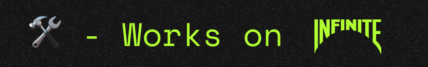
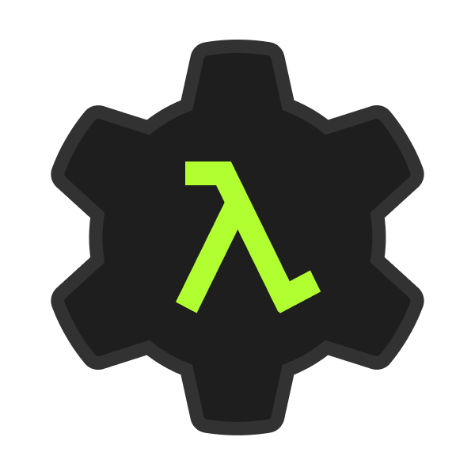
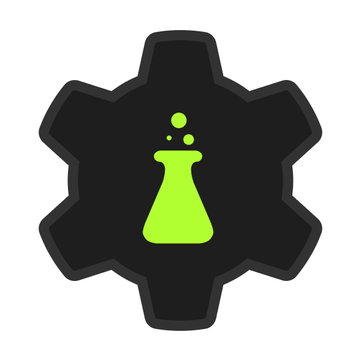
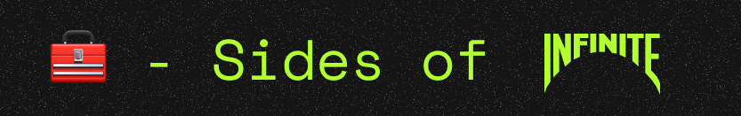
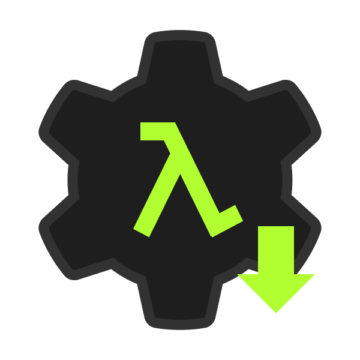

<a href="https://infinite.si">
  <h1 align="center">
    <picture>
      <source media="(prefers-color-scheme: dark)" srcset="./assets/banner.png">
      
    </picture>
  </h1>
</a>

Hello! I'm **Diego**, a passionate advocate for useful, relevant, and healthy technology. My mission is to make tech better, healthier, more secure, and more sustainable. I'm also the founder of [**Infinite**](https://github.com/infiniteHQ).

Most of my work focuses on finding solutions to make technology healthier and more beneficial, while actively combating harmful practices and negative aspects. You can check out the [manifesto](https://infinite.si/manifesto) I follow for more details.

|                | **Project**                                                                                                           | **Description**                                                                                                                                              |
|-------------------------|--------------------------------------------------------------------------------------------------------------------|--------------------------------------------------------------------------------------------------------------------------------------------------------------|
|   | [**Cherry**](https://github.com/infiniteHQ/Cherry)                                                                  | Cherry is a modern, minimalist yet comprehensive UI/UX framework for low-level native applications. It provides a complete solution, including backend support, a rendering engine, and UI components. Built using technologies like ImGui, Vulkan, and SDL. |
|  | [**Vortex**](https://github.com/infiniteHQ/Vortex)                                                                  | Vortex is a comprehensive open creation platform offering a variety of tools for creators and developers. It enables the creation of systems, applications, services, and much more. |
|  | [**Vortex Nodals**](https://github.com/infiniteHQ/Vortex)                                                    | Vortex Nodals is an advanced visual programming interface designed to make coding accessible to everyone, even without prior programming knowledge. Features powerful transpilers to support coding visually and extensive support for new languages like Rust, Go, and Zig. |
|  | [**Vortex Fusion**](https://github.com/infiniteHQ/Vortex)                                                    | Fusion is a toolset designed to make the development of systems, embedded systems, and applications easy and intuitive. It abstracts complex concepts, allowing developers to focus on design, development, and production without worrying about underlying system complexities. |
|  | **Hypernet**                                                                                                       | Hypernet is an advanced networking technology designed around a sandbox paradigm, enabling extensive modding and customization. Originally created to push the boundaries of decentralized networking and environmental networking. |
|    | **Labs**                                                                                                           | Infinite Labs is a sharing platform for makers, aimed at simplifying the process of creating and developing projects. It offers a variety of tools and resources to help creators streamline their workflows and enhance productivity. |

|                | **Project**                                                                                                           | **Description**                                                                                                                                              |
|-------------------------|--------------------------------------------------------------------------------------------------------------------|--------------------------------------------------------------------------------------------------------------------------------------------------------------|
|   | **Blog Service**                                                                 | A microservice designed to manage blog content. It includes features for authenticated editors, content distribution, and blog statistics. Built using PostgreSQL and Go, it ensures robust handling of blog operations and provides insights through various metrics. |
|   | **Account Service**                                                                 |  A user management microservice that handles user authentication and authorization. It leverages OAuth 2.1, two-factor authentication (2FA), and other security best practices to ensure account safety. Developed with PostgreSQL and Go, this service provides secure and scalable user management. |
|   | [**Vortex Launcher**](https://github.com/infiniteHQ/VortexLauncher)                                                                 |   The Vortex Installer is a straightforward utility designed to install or update the Vortex Launcher. It focuses exclusively on the launcher itself, without affecting the Vortex core or any other internal components. This tool ensures that only the launcher is kept up-to-date, leaving the rest of the system unchanged. |
|   | **Vortex Feedback Service**                                                                 |   A service dedicated to collecting and processing crash information from Vortex. It helps developers debug by providing detailed crash reports and insights. The service acts as a feedback loop to enhance application stability and performance. |
|   | **Vortex Updates Service**                                                                 |   The Vortex Updates Service is a microservice that helps all Vortex stacks update and retrieve the latest information for a specific Vortex distribution. The service also includes a "news" system, allowing Vortex stacks to display relevant updates to the user. |
|   | [**Vortex Installer**](https://github.com/infiniteHQ/VortexInstaller)                                                                 |   The Vortex Installer is a straightforward utility designed to install or update the Vortex Launcher. It focuses exclusively on the launcher itself, without affecting the Vortex core or any other internal components. This tool ensures that only the launcher is kept up-to-date, leaving the rest of the system unchanged. |
|   | **API Gateway**                                                                 |    Built on [Janus](https://github.com/motiv-labs/janus), this API Gateway facilitates load balancing, rate limiting, service-to-service communication, and secure authentication. It acts as a central entry point for microservices, ensuring high availability and security while managing traffic flow efficiently. |
|   | **Store Service**                                                                 |    A backend service for managing an online oss marketplace or open ethical store. It includes an item editor for authenticated users, enabling item creation, updates, and distribution. Built with a focus on secure and efficient operations, this service handles the marketplace logic while ensuring proper access control. |
|   | **Funding Service**                                                                 |    A fullstack service for the funding system of Infinite. |
|   | [**Infinite Website**](https://infinite.si/)                                                                 |    The frontend website of Infinite. |
|   | [**Vortex Website**](https://vortex.infinite.si/)                                                                 |    The frontend website of Vortex. |
|   | [**Funding Website**](https://fund.infinite.si/)                                                                 |    The frontend website of the funding website. |
|   | [**Accounts Website**](https://accounts.infinite.si/)                                                                 |    The frontend website of accounts website website. |

## Side projects

| **Project**                                                                                                           | **Description**                                                                                                                                              |
|--------------------------------------------------------------------------------------------------------------------|--------------------------------------------------------------------------------------------------------------------------------------------------------------|
| **Top Down Game**                                                                 | [Quick video of the prototype](https://www.youtube.com/watch?v=yEAfgGU4cqY&list=LL&index=9) This is a little side project with Raylib written in C to learn more about 3D rendering, math, and shaders. |

> [!NOTE]  
> Some repositories don't have links yet, as we are still stabilizing the libraries to avoid wasting the time of users who want to try them out. However, they will be available very soon :)

Mail : 📧 - d@infinite.si

Discord : 📧 - https://discord.com/invite/H2wptkecUg

Website : 📧 - https://infinite.si/
